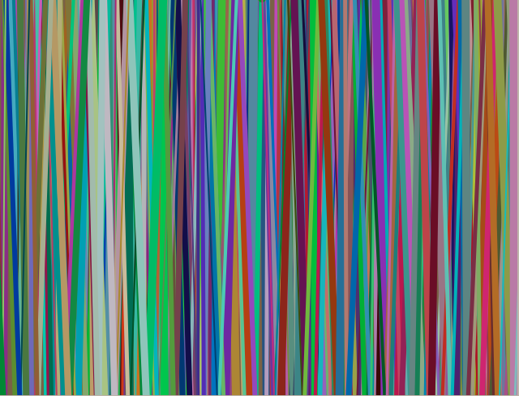

##Turtle Art
This was fun; it's my first stab at computer generated art in Python using [Turtle Graphics for Tkinter](https://docs.python.org/2/library/turtle.html).

Creates artistic modern art style "random" lines of varying colors. Example:  

###Possible improvements:
- Use a more mature imaging library? (the Turtle package is slow for the number of times this is drawing) 
- Improve the distribution of the lines
- Add filtering (programatically) to add "noise" / make it appear more like [real world art materials](http://cdn.dickblick.com/items/200/12/20012-0129-1-3ww-l.jpg)

